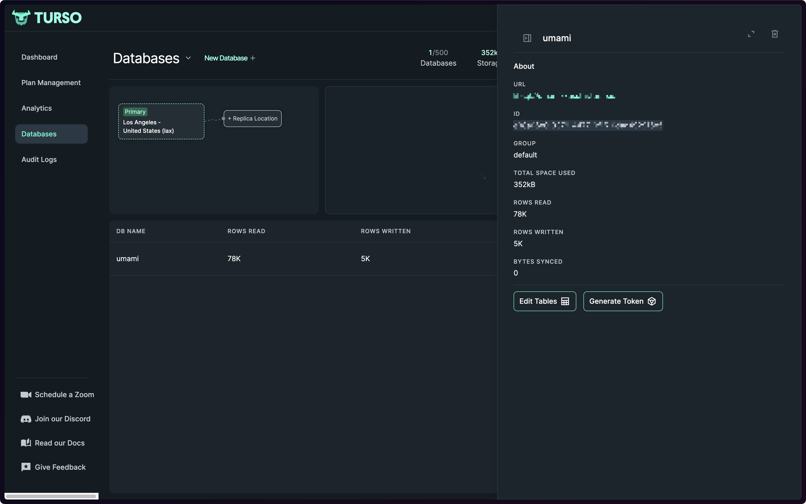
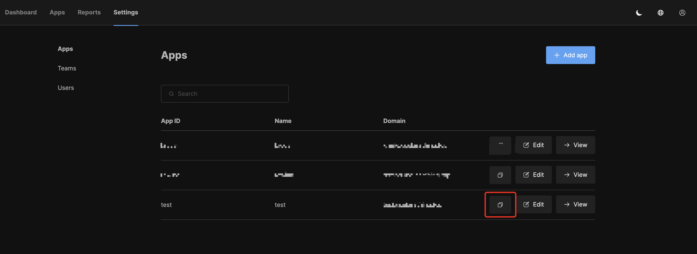
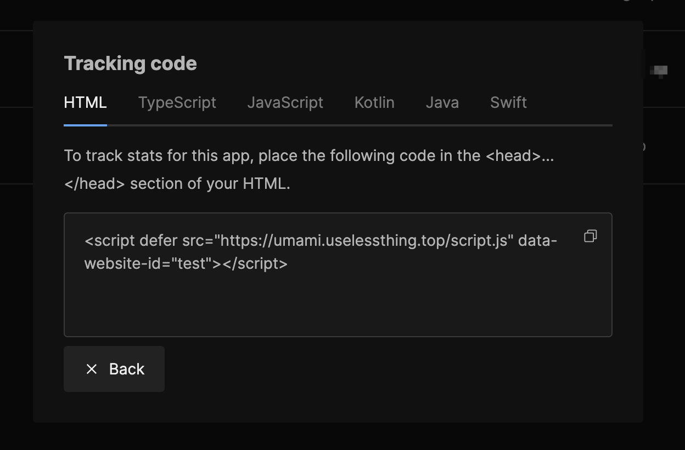

# umami-universal

Umami is a simple, fast, privacy-focused alternative to Google Analytics.

Forked from [umami-software/umami](https://github.com/umami-software/umami), this fork adds a few features:

- [x] Support for [Turso](https://turso.tech) with libSQL, ultra fast.
- [x] Support tracking events for other platforms like Android, iOS, not just web. And provide a copy and paste intergration code for tracking events.
- [x] Rename `website` to `app`, support custom app id, instead of UUID.

## Deploy

### Serverless

- Create a new database on [Turso](https://turso.tech)

Get the `TURSO_DATABASE_URL` from URL(like `libsql://xxx`) and `TURSO_AUTH_TOKEN` from `Gernerate Token`.

- Deploy on Vercel

Click the button above to deploy on Vercel, and fill the Environment Variables `DATABASE_URL=file:./dev.db`, `TURSO_DATABASE_URL`, `TURSO_AUTH_TOKEN` with the value you get from Turso.

- Integrate with your app

After deploy, open your deploy umami, you can login with the default username `admin` and password `umami`.

Go to `settings/websites` and then click `Add app` create a new app

After create, you can see the app item in the table, then click the `copy` button.

Then you can paste the code to your app, and start tracking events.
